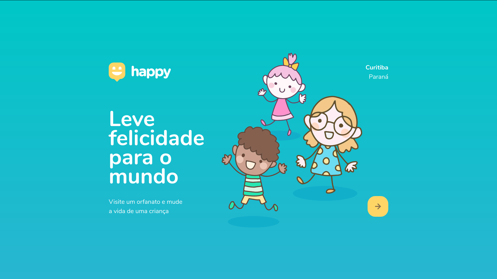
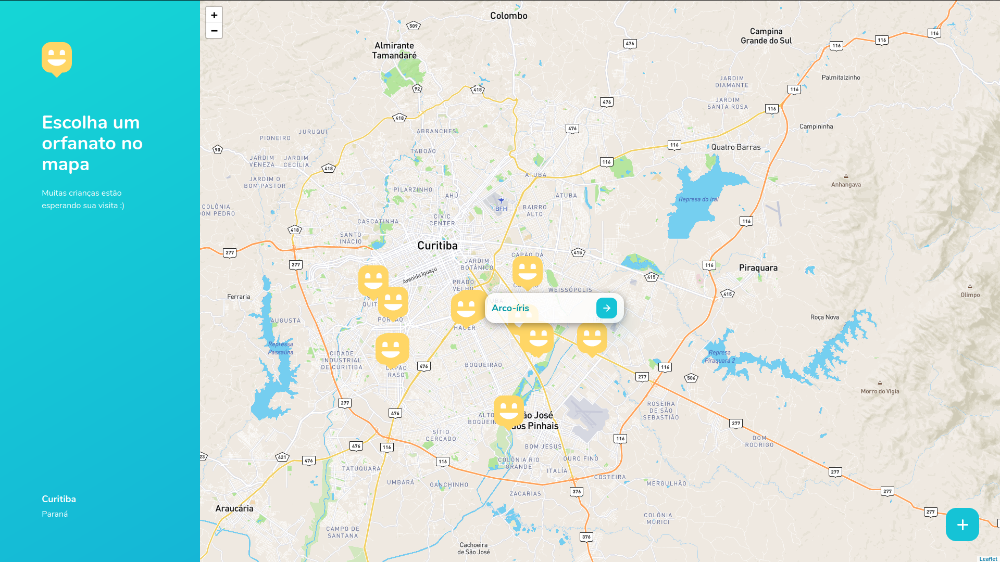
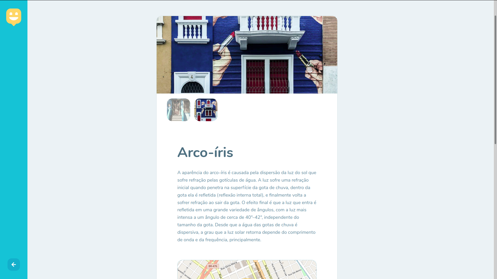
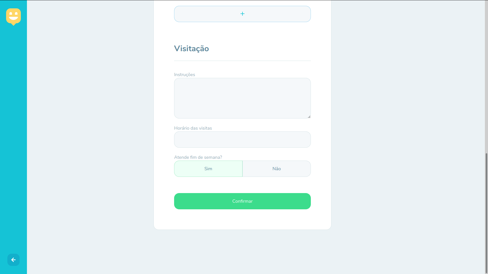
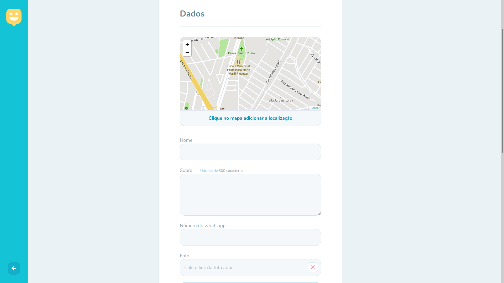

## Aprender programação. Passos iniciais Front-end!
### Conhecimento é poder! 

### Dia 01:
- Iniciando o projeto com: 
- HTML
- CSS
- JavaScript

 No primeiro dia praticamos HTML e CSS.

### Dia 02 - configurando paginas:
- HTML
- CSS
- JavaScript

Um ponto muito positivo desta edição está num detalhe que parece pequeno,
mas muito importante: Mobile First! Mesmo na Trilha Discovery fizemos um Layout
lindo e responsivo. 

### Dia 03 - paginas de cadastro:
- HTML
- CSS
- JavaScript

### Dia 04/05 - backend da aplicação:
- Javascript
- HBS(html)

Para o backend da aplicação usamos:

- banco - sqlite
- NodeJs
- npm
- express
- nodemon
- hbs

